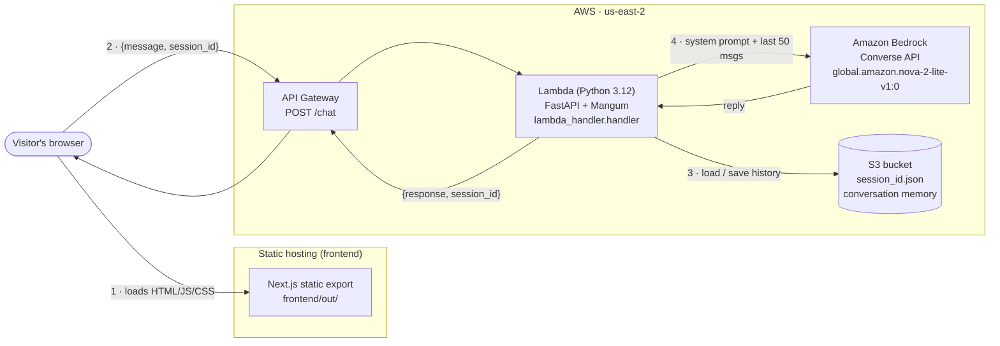

# Twin — Erfan Kashani's personal site + Digital Twin

A personal website built around a **Digital Twin** chatbot: an AI assistant that answers questions about Erfan's background, experience, and projects in his voice. The site has a hero landing page with the embedded chat, a resume section, and a projects section.

- **Frontend** — Next.js 16 (App Router) + React 19 + Tailwind v4, built as a fully static export.
- **Backend** — FastAPI chat API calling **AWS Bedrock** (Amazon Nova 2 Lite by default), run on **AWS Lambda** behind **API Gateway**.
- **Memory** — each chat session's history is stored as a JSON file, locally in `memory/` or in **S3** in production.

## Architecture



**Request flow**

1. The browser loads the static site (HTML/JS/CSS only, with no server runtime).
2. The `<Twin />` chat component `POST`s `{message, session_id}` to the API Gateway `/chat` endpoint. The first call has no `session_id`; the API creates one and the browser keeps it for the rest of the session.
3. Lambda loads that session's history from S3 (`<session_id>.json`).
4. It builds the persona system prompt (`context.py` + `backend/data/`), appends the last 50 messages, calls Bedrock's Converse API, saves the updated history back to S3, and returns the reply.

## Repository layout

```
.
├── frontend/            Next.js 16 static site
│   ├── app/             App Router entry (layout.tsx, page.tsx, globals.css)
│   ├── components/      twin.tsx (chat), resume.tsx, projects.tsx, navbar, hero
│   ├── lib/             projects.ts (project cards data), utils
│   └── public/          static assets
├── backend/             FastAPI chat API
│   ├── server.py        API routes, Bedrock call, memory load/save
│   ├── context.py       builds the digital-twin system prompt
│   ├── resources.py     loads persona data from data/
│   ├── data/            linkedin.pdf, summary.txt, facts.json, style.txt
│   ├── lambda_handler.py  Mangum adapter → Lambda entry point
│   └── deploy.py        builds lambda-deployment.zip (uses Docker)
└── memory/              local conversation storage (created on first chat)
```

## Quick start (local)

### Prerequisites

- Node.js 20+ and npm
- Python 3.12 and [uv](https://docs.astral.sh/uv/) (or plain `pip`)
- AWS credentials with Bedrock access to the model you use (`aws configure` or env vars)
- Docker (only for building the Lambda package)

### 1. Frontend

```bash
cd frontend
npm ci          # install exact locked dependencies (required on a fresh clone)
npm run dev
```

Open **http://localhost:3000**.

> **Use `localhost`, not the "Network" URL.** `next dev` also prints an address like `http://192.168.x.x:3000`. Next 16 blocks dev resources for any address other than `localhost` by default, so on that URL the page's scripts don't load and the animated hero and chat stay invisible. To test from another device (such as your phone), add the IP to `allowedDevOrigins` in `frontend/next.config.ts` and restart the dev server.

> **Heads-up:** the chat endpoint is currently hardcoded in `frontend/components/twin.tsx` to the **deployed** API Gateway URL, so local chat talks to the production backend. To test against a local backend, temporarily point it at `http://localhost:8000/chat`.

### 2. Backend

```bash
cd backend
uv sync                      # or: pip install -r requirements.txt
# create backend/.env as shown below, then:
uv run python server.py      # uvicorn on http://localhost:8000
```

Minimal `backend/.env` for local development:

```dotenv
DEFAULT_AWS_REGION=us-east-2
BEDROCK_MODEL_ID=global.amazon.nova-2-lite-v1:0
USE_S3=false                 # store conversations in ../memory/
CORS_ORIGINS=http://localhost:3000
```

Smoke test:

```bash
curl localhost:8000/health
curl -X POST localhost:8000/chat \
  -H 'Content-Type: application/json' \
  -d '{"message": "Hi, who are you?"}'
```

### Configuration reference (backend)

| Variable | Default | Purpose |
| --- | --- | --- |
| `BEDROCK_MODEL_ID` | `global.amazon.nova-2-lite-v1:0` | Bedrock model / inference profile |
| `DEFAULT_AWS_REGION` | `us-east-1` | Region for the Bedrock client (`AWS_REGION` is reserved on Lambda) |
| `USE_S3` | `false` | `true` stores memory in S3 instead of local files |
| `S3_BUCKET` | — | Memory bucket name when `USE_S3=true` |
| `MEMORY_DIR` | `../memory` | Local memory folder when `USE_S3=false` |
| `CORS_ORIGINS` | `http://localhost:3000` | Comma-separated allowed browser origins |

### API

| Method | Path | Description |
| --- | --- | --- |
| `GET` | `/` | Service info (model, storage mode) |
| `GET` | `/health` | Health check |
| `POST` | `/chat` | `{message, session_id?}` → `{response, session_id}` |
| `GET` | `/conversation/{session_id}` | Full stored history for a session |

## Deploying to AWS

> The AWS resources are not defined as code yet (no Terraform/CDK/SAM). The steps below describe what the code expects; bracketed values like `<bucket>` are placeholders.

### Backend: Lambda + API Gateway + S3

**1. Build the deployment package** (Docker must be running):

```bash
cd backend
uv run python deploy.py      # → backend/lambda-deployment.zip
```

`deploy.py` installs `requirements.txt` inside the official `public.ecr.aws/lambda/python:3.12` image (x86_64) so compiled wheels match Lambda, then zips them together with `server.py`, `lambda_handler.py`, `context.py`, `resources.py`, and `data/`.

**2. S3 memory bucket.** Create a private bucket for conversation history, e.g. `<memory-bucket>`.

**3. Lambda function**

| Setting | Value |
| --- | --- |
| Runtime / arch | Python 3.12 / x86_64 |
| Handler | `lambda_handler.handler` |
| Timeout | ~30 s (the 3 s default is too short for Bedrock calls) |
| Environment | `USE_S3=true`, `S3_BUCKET=<memory-bucket>`, `DEFAULT_AWS_REGION=us-east-2`, `BEDROCK_MODEL_ID=global.amazon.nova-2-lite-v1:0`, `CORS_ORIGINS=<site-origin>[,http://localhost:3000]` |

The execution role needs:
- `bedrock:InvokeModel` on the model / inference profile (the `global.` profile routes across regions, so allow the underlying foundation-model ARNs too),
- `s3:GetObject` and `s3:PutObject` on `arn:aws:s3:::<memory-bucket>/*`,
- the standard `AWSLambdaBasicExecutionRole` for CloudWatch Logs.

Upload / update the code:

```bash
aws lambda update-function-code \
  --function-name <function-name> \
  --zip-file fileb://lambda-deployment.zip \
  --region us-east-2
```

(If the zip grows past 50 MB, upload it to S3 and use `--s3-bucket/--s3-key` instead.)

**4. API Gateway.** Expose the function with routes for `POST /chat`, `GET /health`, and `GET /conversation/{session_id}` (or a `{proxy+}` catch-all) using Lambda proxy integration. CORS is handled by FastAPI via `CORS_ORIGINS`.

### Frontend: static export

```bash
cd frontend
npm ci
npm run build                # output: 'export' → frontend/out/
```

`frontend/out/` is plain static files and can be served from any static host. The intended setup on AWS is **S3 + CloudFront**:

```bash
aws s3 sync out/ s3://<site-bucket>/ --delete
aws cloudfront create-invalidation --distribution-id <dist-id> --paths '/*'
```

Then add the site's origin (e.g. `https://<your-domain>`) to the Lambda's `CORS_ORIGINS`.

> The API URL is baked into the bundle at build time (`frontend/components/twin.tsx`). If the backend URL changes, update it there, rebuild, and redeploy the frontend.

## Troubleshooting

| Symptom | Fix |
| --- | --- |
| `sh: next: command not found` on `npm run dev` | Dependencies aren't installed. Run `npm ci` in `frontend/`. |
| Page loads but the hero animation and chat are invisible | You opened the network IP. Use `http://localhost:3000`, or add the IP to `allowedDevOrigins`. |
| Next warns it "inferred your workspace root" | A `package-lock.json` exists in a parent directory (e.g. your home folder). Remove it if unused, or set `turbopack.root` in `next.config.ts`. |
| Chat fails with a CORS error | The page's origin isn't in the backend's `CORS_ORIGINS`. |
| `403 Access denied to Bedrock model` | Enable model access in the Bedrock console and check the IAM role/credentials. |
| Lambda times out | Raise the function timeout (Bedrock replies can take several seconds). |
